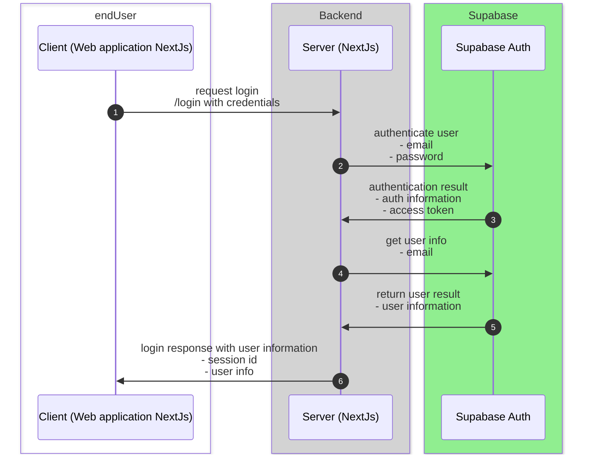

# DevSync Documentation

## Table of Contents
- [DevSync Documentation](#devsync-documentation)
  - [Table of Contents](#table-of-contents)
  - [Revision History](#revision-history)
  - [Introduction](#introduction)
  - [Authentication](#authentication)
  - [General Structure](#general-structure)
  - [Error types](#error-types)
  - [Data Containers](#data-containers)
    - [Users](#users)
      - [Role Enum :](#role-enum-)
    - [Team](#team)
    - [Server](#server)
    - [Project](#project)
    - [SourceCodeInfo](#sourcecodeinfo)
    - [Notification](#notification)
    - [DevTeamMember](#devteammember)
    - [ServerPerProject](#serverperproject)
  - [Data Providers](#data-providers)
    - [Login](#login)
      - [User Information and Access Token](#user-information-and-access-token)

## Revision History

| **Version** | **Date**               | **Changes**     | **Name** |
| ----------- | ---------------------- | --------------- | -------- |
| 0.1.0       | 2024&#8209;08&#8209;05 | initial version | @zouinekh |
| 0.1.1       | 2024&#8209;08&#8209;12 | define get all ai girls and dashboard endpoints, define data containers needed for those dataproviders| @zouinekh |

## Introduction
This document describes the API used for the AI girl platform for the communication between frontend and backend.

## Authentication
The authentication is based on Supabase's built-in authentication system. It supports simple email/password authentication and OAuth for third-party providers like Google.  

To authorize the user the client will always send a session within the request header. If no authorization is available or has expired, the server will redirect to the login page.



## General Structure
All responses are also returned as a json encoded data. A success response has the http code 200 and the following structure:
```json
{
    "statusCode": 200,
    "type": "aicharacters",
    "payload": {
        // additional data
    }
}
```


When errors occurs, the http code and the field `statusCode` within the content body != 200 is returned. Additionally:
-   The type `error` is provided.
-   The payload contains the error code, an error message and optionaly additional data.

This is an error, JSON encoded, response:
```json
{
    "statusCode": 101,
    "type": "error",
    "payload": {
        "errorMessage": "authorization failed"
    }
}
```
## Error types
Some error codes may be handled in a special way by the client:
-   100: authorization failed
-   101: login with authorization code failed
-   102: logout not possible, already logged out
-   103: validation error of input payload (`errorMessage` will contain more details)
-   104: data not found (`errorMessage` will contain more details)
## Data Containers
The responses for different data providers may contain the same data. Therefore generic data containers are defined, that will be reused for different calls. Each container is a json dictionary. Each value for a key can be a data container itself.


### Users

| **Name**     | **Type**   | **Example Value**                  | **Description**                                      |
| ------------ | ---------- | ---------------------------------- | ---------------------------------------------------- |
| id           | Integer    | 1                                  | The unique identifier of the user.                   |
| fullName     | String     | "John Smith"                       | The full name of the user.                           |
| email        | String     | "johnsmith@example.com"            | The email address of the user.                       |
| imgurl       | String     | "https://example.com/profile.jpg"  | The URL of the user's profile image.                 |
| bio         | String     | "BIO HERE"  | Bio                 |
| pushToken        | String     | "dX6r6vV9RGeasKcdzXlfZo:APA91bGDrZqTr2HKzGcNkbE0..."            | The email address of the user.                       |
| created_at   | DateTime   | "2024-08-02T10:00:00Z"             | The date and time when the user was created.         |
| authid   | uuid   | "fe25a9e9-7232-4d65-ab7e-6a16944151fd"             | It represent the id of the built in auth table in supabase    |

#### Role Enum : 
-   ADMIN
-   MANAGER
-   USER

### Team

| **Name**         | **Type**           | **Example Value**               | **Description**                                  |
| ---------------- | ------------------ | -------------------------------- | ------------------------------------------------ |
| id               | bigint             | 1                                | The unique identifier of the team.               |
| objective        | text               | "Complete the project roadmap"   | The main objective or goal of the team.          |
| teamName         | string  | "Development Team A"             | The name of the team.                            |
| closedProject    | bigint             | 2                                | The identifier of the related closed project.    |
| teamDescription  | text               | "Team working on project X"      | A description of the team's purpose and work.    |
| created_at       | timestamp with time zone | "2024-08-02T10:00:00Z"     | The date and time when the team was created.     |

### Server

| **Name**            | **Type**               | **Example Value**                                 | **Description**                                  |
| ------------------- | ---------------------- | ------------------------------------------------ | ------------------------------------------------ |
| id                  | bigint                 | 1                                                | The unique identifier of the server.             |
| created_at          | timestamp with time zone | "2024-08-02T10:00:00Z"                          | The date and time when the server was created.   |
| credentials         | jsonb                  | `{ "username": "admin", "password": "secret" }`  | The server's credentials stored as JSON.         |
| provider            | string      | "AWS"                                            | The server provider (e.g., AWS, Google Cloud).   |
| isUsed              | boolean                | true                                             | Whether the server is currently being used.      |
| createdBy           | bigint                 | 2                                                | The identifier of the user who created the server.|
| metaInformation     | jsonb                  | `{ "OS": "Linux", "RAM": "16GB" }`               | Additional metadata about the server stored as JSON. |

### Project

| **Name**              | **Type**               | **Example Value**                                | **Description**                                  |
| --------------------- | ---------------------- | ------------------------------------------------ | ------------------------------------------------ |
| id                    | bigint                 | 1                                                | The unique identifier of the project.            |
| projectName           | string      | "DevSync"                                        | The name of the project.                         |
| projectDescription    | text                   | "A project management tool for developers."      | A description of the project.                    |
| projectLink           | string      | "https://devsync.com"                            | The link to the project website or repository.   |
| imgUrl                | string      | "https://example.com/project-image.jpg"          | The URL of the project's image.                  |
| projectConfig         | jsonb                  | `{ "language": "JavaScript", "framework": "Next.js" }` | The configuration details of the project stored as JSON. |
| createdBy             | bigint                 | 2                                                | The identifier of the user who created the project. |
| notificationConfig    | jsonb                  | `{ "email": true, "sms": false }`                | The project's notification settings stored as JSON. |
| created_at            | timestamp with time zone | "2024-08-02T10:00:00Z"                          | The date and time when the project was created.  |

### SourceCodeInfo

| **Name**          | **Type**               | **Example Value**                                   | **Description**                                  |
| ----------------- | ---------------------- | -------------------------------------------------- | ------------------------------------------------ |
| id                | bigint                 | 1                                                  | The unique identifier of the source code information. |
| created_at        | timestamp with time zone | "2024-08-02T10:00:00Z"                            | The date and time when the source code info was created. |
| credentials       | jsonb                  | `{ "token": "abc123", "username": "dev" }`         | The credentials for accessing the source code, stored as JSON. |
| provider          | string      | "GitHub"                                           | The source code provider (e.g., GitHub, GitLab). |
| isUsed            | boolean                | true                                               | Whether the source code info is currently being used. |
| repoLink          | text                   | "https://github.com/user/repo"                     | The link to the repository where the source code is stored. |
| webhookLink       | text                   | "https://example.com/webhook"                      | The link to the webhook for the repository.      |
| projectId         | bigint                 | 2                                                  | The identifier of the project associated with the source code. |

### Notification

| **Name**          | **Type**               | **Example Value**                                   | **Description**                                  |
| ----------------- | ---------------------- | -------------------------------------------------- | ------------------------------------------------ |
| id                | bigint                 | 1                                                  | The unique identifier of the notification.       |
| projectId         | bigint                 | 2                                                  | The identifier of the project associated with the notification. |
| content           | text                   | "New feature added to the project."                | The content or message of the notification.      |
| icon              | string                 | "https://example.com/icon.png"                     | The URL of the icon associated with the notification. |
| created_at        | timestamp with time zone | "2024-08-02T10:00:00Z"                            | The date and time when the notification was created. |

### DevTeamMember

| **Name**          | **Type**                             | **Reference**                              | **Description**                                  |
| ----------------- | ------------------------------------ | ------------------------------------------ | ------------------------------------------------ |
| id                | bigint                               |                                            | The unique identifier of the development team member. |
| userId            | [User](#users)                       | See [User](#users)                         | The identifier of the user associated with the development team. |
| teamid            | [Team](#team)                        | See [Team](#team)                          | The identifier of the team to which the member belongs. |
| post              | string                               |                                            | The post or role of the team member in the development team. |
| postDescription   | text                                 |                                            | A description of the team member's post or responsibilities. |
| metaInformation   | jsonb                                |                                            | Additional metadata about the team member.       |
| created_at        | timestamp with time zone             |                                            | The date and time when the development team member record was created. |

### ServerPerProject

| **Name**          | **Type**              | **Reference**          | **Description**                                    |
| ----------------- | --------------------- | ---------------------- | -------------------------------------------------- |
| id                | bigint                |                        | The unique identifier of the server associated with the project. |
| created_at        | timestamp with time zone |                        | The date and time when the server record was created. |
| projectId         | [Project](#project)   | See [Project](#project) | The identifier of the project associated with the server. |
| serverId          | [Server](#server)     | See [Server](#server)   | The identifier of the server associated with the project. |
| additionalInfo    | jsonb                 |                        | Additional metadata or information related to the server in the project. |


## Data Providers
Data providers are functions that returns data containers filled with the appropriate data.

### Login
This call is used to connect the user.

*   Parameters:

    | **Name** | **Type** | **Example Value** | **Description** |
    | -------- | -------- | ----------------- | --------------- |
    | email    | String   | "xxx@xxx.xxx"     | email of user   |
    | password | String   | "xxxxxxxxx"     | password of the user   |

*   Response
 the response is returned and additionaly the following data in json format:
#### User Information and Access Token

| **Name**     | **Type** | **Example Value**               | **Description**                                                  |
| ------------ | -------- | ------------------------------- | ---------------------------------------------------------------- |
 | userInformation |[User](#users)   | see [here](#users) | User information |
| accessToken | String   | "exampleAccessToken"            | The token to be used for accessing secure endpoints or services. |


May trigger the error code 101 if the user doesn't exist.
May trigger the error code 102 if the information are not valid.
